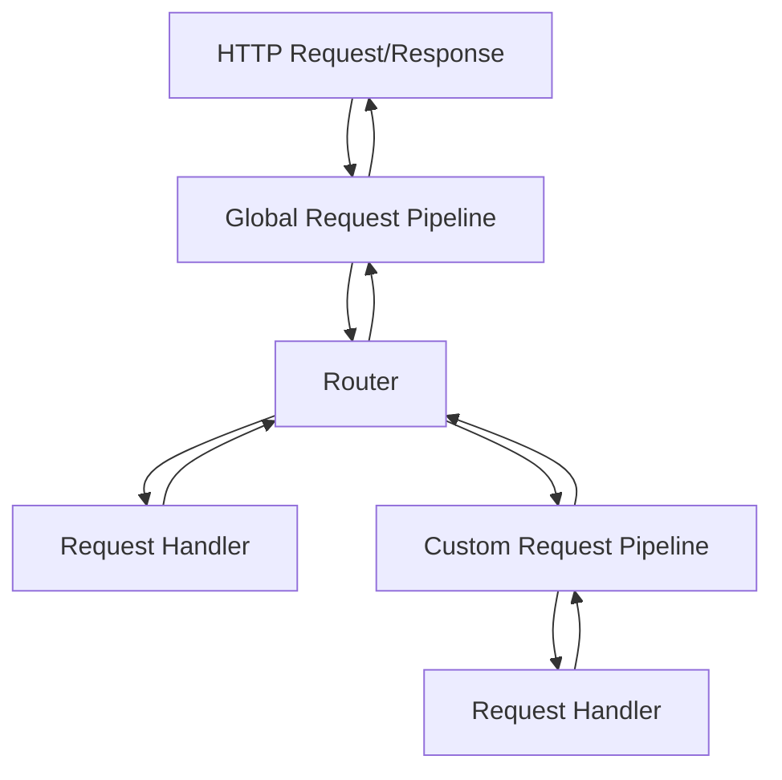

# HTTP Server

This is a simple HTTP server which can serve both static files and custom endpoints written in C#.

## Request Pipeline

The server uses a series of request pipelines to handle incoming requests. Every request is passed through the global request pipeline, which will then route the request to the correct endpoint. The request can then either be processed using custom pipelines or the global pipeline can execute the request handler directly if no pipeline is configured.

A request pipeline is a series of plugins that are executed in order. Each plugin can modify the request and response objects, and can also short-circuit the pipeline by returning a response directly.



## Sample

Below is an example of a server configured to serve static files from the `wwwroot` directory, with a custom endpoint at `/api/helloworld/`.

The `/api/helloworld/` endpoint is configured to use a custom pipeline named `TestPipeline`, which contains a custom plugin defined in the `TestPlugin` class.

```csharp
using HttpServer;
using HttpServer.Response;
using HttpServer.Routing;
using HttpServer.Routing.StaticFiles;
using Server;

var builder = HttpWebServer.CreateBuilder(9999);
var server = builder.Build();

server.AddPipeline("TestPipeline", options =>
{
    options.AddPlugin<TestPlugin>();
});

server.MapGet("/api/helloworld/", "TestPipeline", _ => HttpResponse.Ok("Hello, World!"));
server.ServeDirectory("/", "wwwroot");

await server.StartAsync();
```
